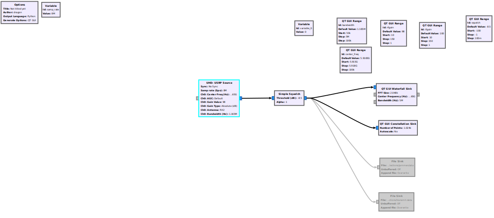

# gnuradioRX-Jamming

gnuradio receiver code as well as documentation of the modifications made to the WPI jammer

# Jammer

The jammer we are using is a modified version of one written by YaYa Brown and Cynthia Teng of Worcester Polytechnic Institute. This jammer does not work with the latest version of gnuradio due to the `ofdm mod` block being phased out. The workaround to this was to use a docker image provided by our graduate student advisor and client, Stefan Gvozdenovic, which uses gnuradio version 3.7.11. The docker image is available [here](https://github.com/gefa/cv2x-docker-grc3.7).

YaYa Brown and Cynthia Teng's paper (which links to jammer) is available [here](https://digital.wpi.edu/concern/student_works/hm50tv580?locale=en) and the citation for their work is the following:

*Brown, YaYa Mao, and Cynthia Teng. *Lte Frequency Hopping Jammer.* : Worcester Polytechnic Institute, 2019.

# Jammer Modifications

The following modifications were made to the jammer code:
* `random.randrange(2.6775e9,2.6825e9,1e3))` changed to `random.randrange(5.9165e9,5.917e9,1e3)` (center frequency)
* `time.sleep(1.0 / (40))` changed to `time.sleep(1.0)` (duration between jamming frequency hopping)

# C-V2X Traffic Generator

We used Fabian Eckermann's [`cv2x-traffic-generator`](https://github.com/FabianEckermann/cv2x-traffic-generator) library in order to generate OTA c-v2x traffic. The citation for his work is the following:

F. Eckermann, C. Wietfeld, *SDR-based open-source C-V2X traffic generator for stress testing vehicular communication*, In 2021 IEEE 93rd Vehicular Technology Conference (VTC-Spring), Helsinki, Finland, April 2021.

# Receiver

Our receiver code for data collection and visualization was written in gnuradio:

After adjusting gain and squelch in order to remove most noise, we collected data for the following scenarios:

*A capture of OTA `cv2x_traffic_generator`*

